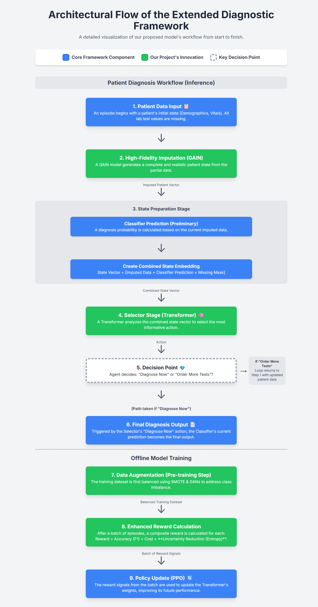

# Cost-Effective Diagnosis of Sepsis & AKI using a Transformer-Driven RL Policy

Team 3: Vamsi Chinnam · Harika Devi Bandaru · Abhishek (Ashish) Kumar · Shravani Dosapati

An end-to-end, cost-aware clinical decision support pipeline on MIMIC-IV for Sepsis and AKI. The system learns to order lab panels sequentially and decide when to diagnose, targeting strong accuracy–cost trade-offs. This repository extends the ICLR 2023 baseline (“Deep Reinforcement Learning for Cost-Effective Medical Diagnosis”) with a Transformer-based selector, improved imputation, and class-imbalance handling.

--------------------------------------------------------------------------------

## 1. Overview and Scope

- Problem: Given partial labs and vitals within the early ICU window, learn a policy that orders additional panels only when useful, then diagnose.
- Datasets: MIMIC-IV cohorts for Sepsis and AKI.
- Actions: Order a lab panel (CBC, CMP, ABG, aPTT) or Diagnose.
- Objective: Maximize clinical utility (recall/accuracy) while penalizing test cost via reward shaping.
- Deliverables: Reproducible preprocessing, baselines, RL selector, and evaluation scripts.

This repository is designed for researchers and engineers who want a clear, reproducible implementation that is easy to extend with new selectors, cost models, or cohorts.

--------------------------------------------------------------------------------

## 2. What is new relative to the base paper

- Transformer selector (self-attention) for context-aware sequential test selection, replacing a plain feed-forward policy.
- GAIN imputation for higher-fidelity handling of missing values in EHR tables.
- Hybrid imbalance strategy for AKI (SMOTE + CTGAN) to enrich minority-class variability without contaminating validation/test.
- Cost-aware reward shaping R = λ·utility − ρ·cost, controlled in YAML; utility is typically recall-centric for safety in under-diagnosis.
- Maskable PPO with action masks to prevent re-ordering the same panel and to enforce the “minimum tests before diagnose” constraint.
- Reproducible configs, metrics (AUROC, F1/BACC, cost per patient), and plots (ROC/PR, calibration, panel-usage).




--------------------------------------------------------------------------------

## 3. Repository Layout

```
.
├── configs/                 # YAML configs (paths, seeds, λ, ρ, model hparams)
├── data/
│   ├── raw/                 # user-provided MIMIC-IV exports
│   ├── interim/             # intermediate CSVs
│   └── processed/           # feature matrices (train/val/test)
├── notebooks/               # analysis and EDA
├── reports/                 # Final_report_team_3.pdf, Interim_Sepsis.pdf, AKI_Pipeline.pdf
├── results/                 # metrics.json, plots/, models/
├── scripts/
│   └── preprocess_aki_basepaper.py  # AKI preprocessing and KDIGO labels (72 h horizon)
├── src/
│   ├── data_loader_csv.py
│   ├── imputer.py           # GAIN or EMFlow implementation
│   ├── reward_shaping.py
│   ├── rl.py                # Transformer selector + Maskable PPO policy
│   ├── train.py             # end-to-end orchestration (impute → classifier → RL)
│   ├── evaluate.py          # metrics + plots
│   └── utils/               # helpers (costs, seeds, logging)
└── images/                  # architecture diagrams, sample plots
```

--------------------------------------------------------------------------------

## 4. Datasets, Cohorts, and Governance

- Source: MIMIC-IV v3.1 (ICU cohorts). Access requires PhysioNet credentialing and completion of the data use agreement.
- Cohorts:
  - Sepsis: patients with sufficient early vitals and labs; four lab panels are modeled for sequential ordering (CBC, CMP, ABG, aPTT).
  - AKI: ICU stays with creatinine measurements sufficient for KDIGO label derivation.
- Ethics and compliance: This repository contains only derived artifacts and code. Do not export PHI. Follow all MIMIC-IV usage guidelines. Keep raw data within approved environments.

--------------------------------------------------------------------------------

## 5. Feature Schema and Labels

### 5.1 Visible features (no cost)
- Demographics: age, gender (binary-encoded).
- Physiologic: early-window vitals summarized by mean/min/max where available (heart rate, SBP, DBP, respiratory rate, SpO2, temperature).

### 5.2 Lab panels (costed actions)
- CBC: hemoglobin, hematocrit, WBC, RBC, platelets.
- CMP: glucose, bicarbonate/CO2, anion gap, BUN, creatinine, potassium, sodium, calcium.
- ABG: pH, O2 saturation (plus base excess in some variants).
- aPTT/Coag: aPTT; INR optional depending on cohort definition.

Panel costs are provided in utils and referenced during RL training for reward computation.

### 5.3 Label definitions
- Sepsis label: as defined in our sepsis pipeline documentation and interim report (early-window supervised target used by baseline classifiers and RL terminal reward).
- AKI label: KDIGO based on serum creatinine. Baseline creatinine is taken as the minimum within the first 7 days after ICU admission; AKI is positive if any 48 h window within the first 72 h shows either an absolute rise of at least 0.3 mg/dL or a relative rise of at least 1.5x baseline.

--------------------------------------------------------------------------------

## 6. Preprocessing

- Time windows:
  - Feature window: first 24 h from ICU admission for vitals and labs.
  - AKI prediction horizon: onset within 72 h from ICU admission.
- Item IDs: Replace placeholders in scripts/preprocess_aki_basepaper.py with site-specific itemids from d_items and d_labitems.
- Missing data:
  - Train an imputer on training splits only, then transform validation/test (GAIN or EMFlow).
- Scaling and encoding:
  - Z-score continuous features; binary-encode gender and other binary fields.
- Splits:
  - Stratified train/validation/test with 75/15/10 proportions by default.

The AKI preprocessing script writes a single feature matrix CSV with demographics, vitals summaries, labs, and the AKI label. Sepsis preprocessing follows the same conventions with disease-appropriate labels.

--------------------------------------------------------------------------------

## 7. Environment

- Python 3.10+
- CUDA-capable GPU recommended for RL and Transformer training
- Installation
```
python -m venv .venv
.venv\Scripts\activate        # Windows
# source .venv/bin/activate     # macOS/Linux
pip install -r requirements.txt
```

--------------------------------------------------------------------------------

## 8. Quickstart

### 8.1 Preprocess (AKI example)
```
python scripts/preprocess_aki_basepaper.py   --icustays data/raw/icustays.csv   --patients data/raw/patients.csv   --chartevents data/raw/chartevents.csv   --labevents data/raw/labevents.csv   --outdir data/processed
# Output: data/processed/aki_feature_matrix.csv
```

### 8.2 Split, impute, scale
- Perform stratified train/val/test split.
- Fit the imputer on train only and transform val/test.
- Apply standardization and save the processed matrices per split.

### 8.3 Train baselines
```
python src/train.py --task sepsis --config configs/sepsis.yaml
python src/train.py --task aki    --config configs/aki.yaml
# Example flags: --clf xgb --max_depth 4 --n_estimators 400 --seed 42
```

### 8.4 Train RL selector
```
python src/train.py --task sepsis --config configs/sepsis_rl.yaml --mode rl
python src/train.py --task aki    --config configs/aki_rl.yaml    --mode rl
# YAML controls λ (recall weight), ρ (cost penalty), model dims, PPO hparams, steps
```

### 8.5 Evaluate and plot
```
python src/evaluate.py --task sepsis --config configs/sepsis.yaml
python src/evaluate.py --task aki    --config configs/aki.yaml
# Outputs: results/{task}/metrics.json and plots/(roc, pr, calibration, panel_usage).png
```

--------------------------------------------------------------------------------

## 9. Configuration (YAML)

```
task: aki
paths:
  data: data/processed
  results: results/aki
random_seed: 42

features:
  visible: [age, gender, hr_mean, sbp_mean, dbp_mean, rr_mean, spo2_mean, temp_mean]
  panels:
    CBC:  { tests: [hemoglobin, hematocrit, wbc, rbc, platelets], cost: 44 }
    CMP:  { tests: [glucose, bicarbonate, anion_gap, bun, creatinine, potassium, sodium, calcium], cost: 48 }
    ABG:  { tests: [ph, o2_sat], cost: 473 }
    aPTT: { tests: [aptt], cost: 26 }

imputation:
  type: gain
  epochs: 200
  batch_size: 512

rl:
  min_tests_before_diagnose: 2
  lambda: 4.0
  rho: 0.5
  algo: maskable_ppo
  policy: transformer
  steps: 1000000
```

--------------------------------------------------------------------------------

## 10. Experiments and Ablations

- Class imbalance handling (AKI):
  - Raw + class weights
  - SMOTE + CTGAN
- Utility–cost trade-offs:
  - Grid search or Bayesian tuning over λ and ρ.
- Policy architectures:
  - Feed-forward vs Transformer selector.
- Reporting:
  - Always validate and test on raw (non-oversampled) splits.
  - Prefer F1, AUPRC, and BACC for imbalanced tasks; include calibration reliability diagrams.

--------------------------------------------------------------------------------

## 11. Cost Model

Default panel costs are defined in utils and referenced by the RL reward. Adjust as needed for different settings. Keep costs consistent across training and evaluation to ensure fairness in Pareto comparisons.

--------------------------------------------------------------------------------

## 12. Reproducibility

- Determinism: seeds are set for numpy and torch; pass --seed in scripts and set in YAML.
- No leakage: fit imputers and oversamplers on training folds only.
- Logging: store all configs under configs/, and write run artifacts under results/{task}/{run_id}/.

--------------------------------------------------------------------------------

## 13. Limitations and Roadmap

- Reward shaping requires tuning of λ and ρ for the desired operating point.
- GAN-based oversampling can introduce artifacts if overfit; monitor with calibration and PR curves.
- External validity not established; policies should be validated clinically before deployment.
- Planned work:
  - Automated λ, ρ tuning and Pareto frontier reporting.
  - Meta-learning across diseases.
  - Causal feature modeling for panel ordering.
  - Physician-in-the-loop evaluation.

--------------------------------------------------------------------------------

## 14. References

- Yu et al., Deep Reinforcement Learning for Cost-Effective Medical Diagnosis, ICLR 2023.
- MIMIC-IV (Johnson et al.), PhysioNet resource and associated documentation.
- KDIGO Clinical Practice Guideline for Acute Kidney Injury.

--------------------------------------------------------------------------------

## 15. Citation

```
@inproceedings{yu2023costeffective,
  title={Deep Reinforcement Learning for Cost-Effective Medical Diagnosis},
  booktitle={ICLR},
  year={2023}
}
```

--------------------------------------------------------------------------------

## 16. Contact

For questions or collaboration, open an issue or contact the team members listed above.
