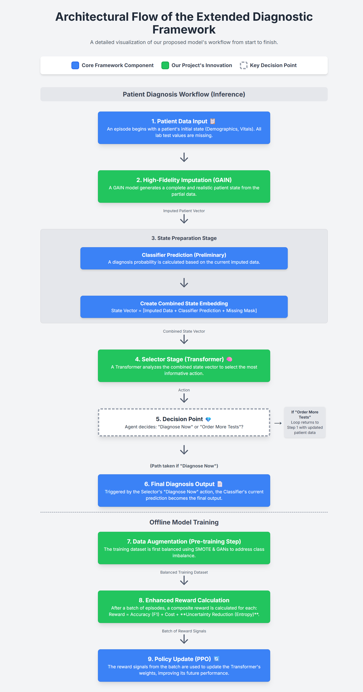

# Cost-Effective Diagnosis of Sepsis and AKI using a Transformer-Driven Reinforcement Learning Policy

**Team 3 Members:** Vamsi Chinnam, Harika Devi Bandaru, Ashish Kumar, Shravani Dosapati

---

## 1. Project Overview

This project develops a novel Reinforcement Learning (RL) framework to create an intelligent agent capable of performing cost-effective and uncertainty-aware medical diagnosis. The primary goal is to build a model that can sequentially select the most informative lab tests for diagnosing Sepsis and Acute Kidney Injury (AKI), thereby minimizing financial costs while maximizing diagnostic accuracy and confidence.

Our work extends the foundational research by Zheng Yu et al. (2023) by introducing several key architectural and methodological innovations:
* A **Generative Adversarial Imputation Network (GAIN)** for high-fidelity handling of missing clinical data.
* A **Transformer-based selector** that uses self-attention to make more intelligent and context-aware decisions.
* A **hybrid data augmentation strategy** (SMOTE & GANs) to address severe class imbalance.
* An **enhanced reward function** that incorporates Shannon Entropy to explicitly reward the agent for reducing its own diagnostic uncertainty.

The entire framework is developed and validated on the comprehensive, real-world **MIMIC-IV (v3.1)** critical care dataset.

## 2. Architectural Flowchart

The following flowchart provides a detailed, step-by-step visualization of our proposed architecture, highlighting the core components and our specific innovations.



## 3. Repository Structure

This repository is organized into the following directories: # 1234

* **/data/**: Contains the final, cleaned feature matrices and other small data files.
* **/notebooks/**: Includes all Jupyter Notebooks used for data exploration, analysis, and model prototyping. The script for the preliminary MIMIC-IV analysis can be found here.
* **/src/**: Contains the core Python source code (`.py` files) for our models, including the GAIN imputer, the Transformer selector, and the RL environment.
* **/docs/**: Includes all project documentation, such as the final proposal PDF.
* **/images/**: Contains all images and visual assets, including the `Flow_chart_em.png`.

## 4. Getting Started

### Prerequisites

* Python 3.9+
* Access to the MIMIC-IV (v3.1) dataset. You must complete the required credentialing on PhysioNet to gain access.
* A GPU-accelerated environment is highly recommended for model training (e.g., Google Colab with GPU runtime or the requested university cloud resources).

### Setup and Installation

1.  **Clone the repository:**
    ```bash
    git clone [https://github.com/Team3-Medical-AI-Project/cost-effective-diagnosis-using-a-transformer-driven-rl-policy.git](https://github.com/Team3-Medical-AI-Project/cost-effective-diagnosis-using-a-transformer-driven-rl-policy.git)
    cd cost-effective-diagnosis-using-a-transformer-driven-rl-policy
    ```

2.  **Set up a virtual environment (recommended):**
    ```bash
    python -m venv venv
    source venv\Scripts\activate  # On Mac, use `venv/bin/activate`
    ```

3.  **Install the required libraries:**
    ```bash
    pip install -r requirements.txt
    ```

### Running the Analysis


## 5. Project Status

This project is currently in the **Planning / Analysis phase**. The immediate next steps are to complete the preliminary data analysis and finalize the implementation plan for the core models.

---
